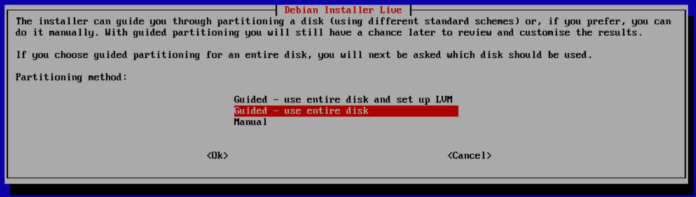
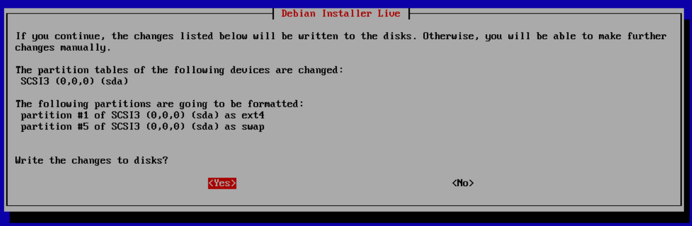
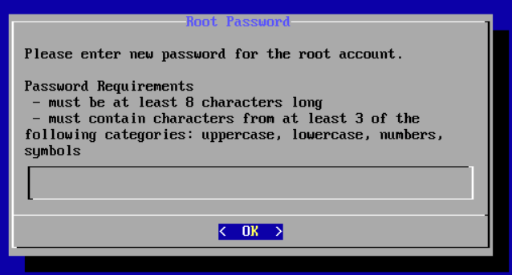

CubeWorxOS is a custom TurnKey Linux distro for running CubeWorx Docker containers. It comes pre-loaded with docker & docker-compose.

The CubeWorx application is NOT included in CubeWorxOS at this time!

## Installation

## First Boot

## Confconsole

